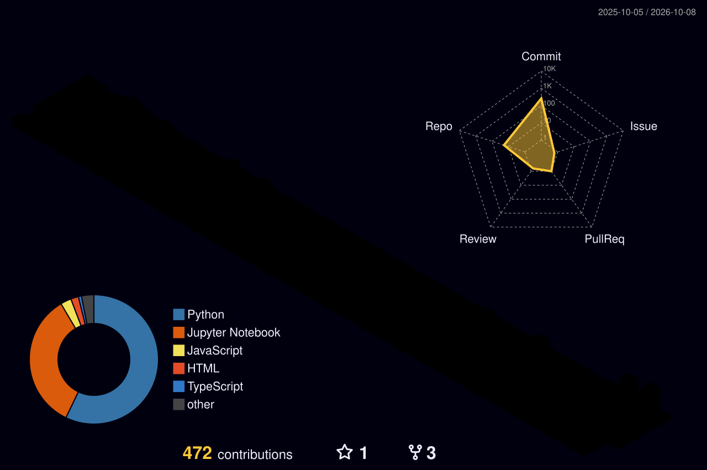

# Hi, I'm Harshit Garg 👋

### AI Engineer | Machine Learning | Deep Learning | Python

I'm a Computer Science Engineering graduate focused on building practical AI/ML systems, intelligent automation, and data-driven applications.

- 🤖 Focused on **AI Engineering, Machine Learning & Deep Learning**
- 🐍 Building with **Python, TensorFlow, Scikit-learn & PyTorch**
- 🧠 Exploring **Generative AI, AI Agents & intelligent automation**
- 🔐 Background in **Cybersecurity, Networking & Intrusion Detection**
- 💻 Also experienced with **C++, JavaScript, React, Node.js & MongoDB**
- 🚀 Currently building AI-focused projects and preparing for **AI/ML Engineer roles**

## 🛠️ Tech Stack

**AI / ML:** Python · NumPy · Pandas · Scikit-learn · TensorFlow · Keras · PyTorch · XGBoost · LightGBM

**Development:** C++ · JavaScript · React.js · Node.js · HTML · CSS · REST APIs · Streamlit

**Data & Visualization:** Plotly · Matplotlib · MySQL · MongoDB

**Tools:** Git · GitHub · Docker · Linux · VS Code

## 🚀 Featured Projects

- **BlackBox — Adversarial Intrusion Detection System**  
  Machine-learning based intrusion detection using ensemble models and adversarial techniques.

- **CrystalliteML**  
  ML pipeline using Random Forest/XGBoost with SHAP-based explainability and model interpretation.

- **AutoTubeAI**  
  Automated content-production pipeline covering research, ideation, scripting, storyboarding, video generation, TTS and publishing.

- **AI / ML Practice**  
  Hands-on implementations covering preprocessing, feature engineering, regression, classification, EDA and model evaluation.

## 📊 GitHub Activity

## 🔗 Connect With Me

- 💼 [LinkedIn](https://www.linkedin.com/in/harshit-garg-76194b252/)
- 💻 [GitHub](https://github.com/Harshit765G4)
- 🧩 [LeetCode](https://leetcode.com/u/harshit765/)

---
> Building systems that turn data and intelligence into useful software.
